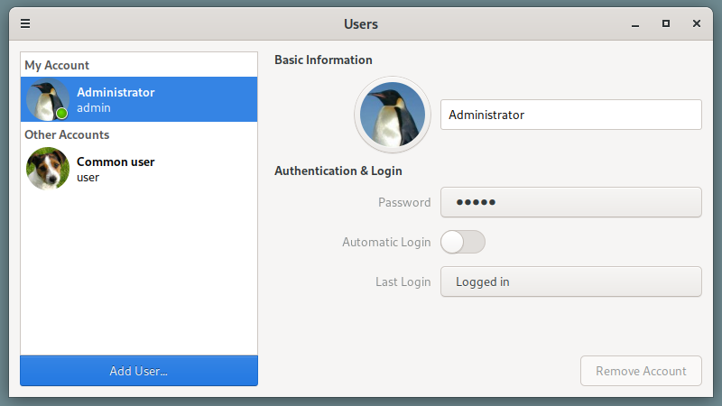

# Xings User Accounts

Yet another fork of GNOME control center to extract user-accounts panel.

It can be used as a standalone application or as a plugin for the Mate Control
Center or Xfce4 settings manager.

## Screenshots

